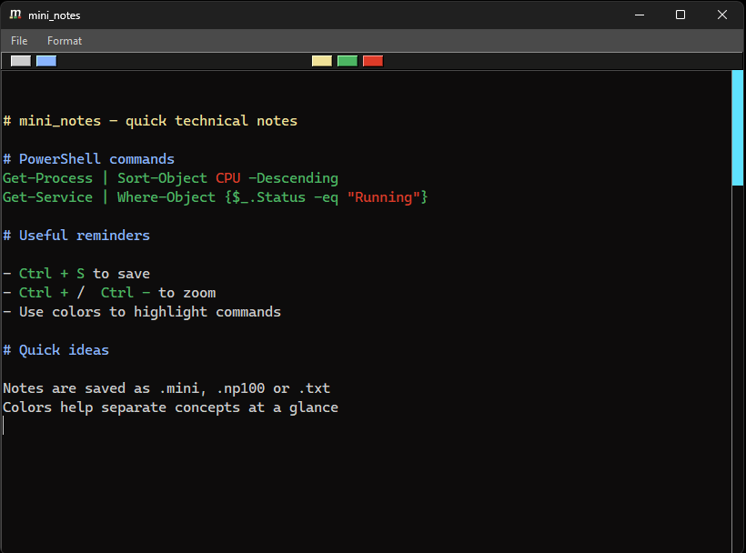

# mini_notes

**mini_notes** is a lightweight desktop application for taking quick technical notes in a clearer and more visual way than a plain text editor.  
It was born as a personal tool while experimenting with Python UI development, and it has grown into a small but reliable companion for daily work and study.

I often take notes about PowerShell, commands, and small experiments, so I wanted a minimal space where I could use color to distinguish ideas, commands, or key fragments at a glance.  
The color palette and font inspiration come partly from how I naturally organize information when working in PowerShell.

---

## Features

- Lightweight text editor  
- Five quick text‑color options  
- Save and load notes (`.mini`, `.np100`, `.txt`)  
- Custom application icon  
- Minimal and distraction‑free interface  
- Zoom in/out (Ctrl + / Ctrl -)

---

## Screenshot



---

## Installation & Usage (Source)

Clone the repository and run the main script:

```bash
git clone https://github.com/Dodotovsky/mini_notes.git
cd mini_notes
python notes.py
```

---

## Download mini_notes

If you prefer the standalone Windows executable, download the latest build:

**[mini_notes – Latest Windows Release](https://github.com/Dodorovsky/mini_notes/releases/tag/v1.1.0)**

No installation required — just run the `.exe`.

---

## ⚠️ Windows SmartScreen

Windows Defender SmartScreen may show a warning when running the executable:

> “Windows protected your PC. Microsoft Defender SmartScreen prevented an unrecognized app from starting.”

This happens because the application is unsigned.  
If you trust the project, click **More info → Run anyway**.

---

## Future Improvements

- Better code organization  
- Additional formatting options  
- Export notes  
- Keyboard shortcuts (e.g., Ctrl+S to save)  
- Context menu actions (right‑click for colors or formatting)  
- More flexible font controls

---

## License

This project is licensed under the **MIT License** — see the [LICENSE](./LICENSE) file for details.
